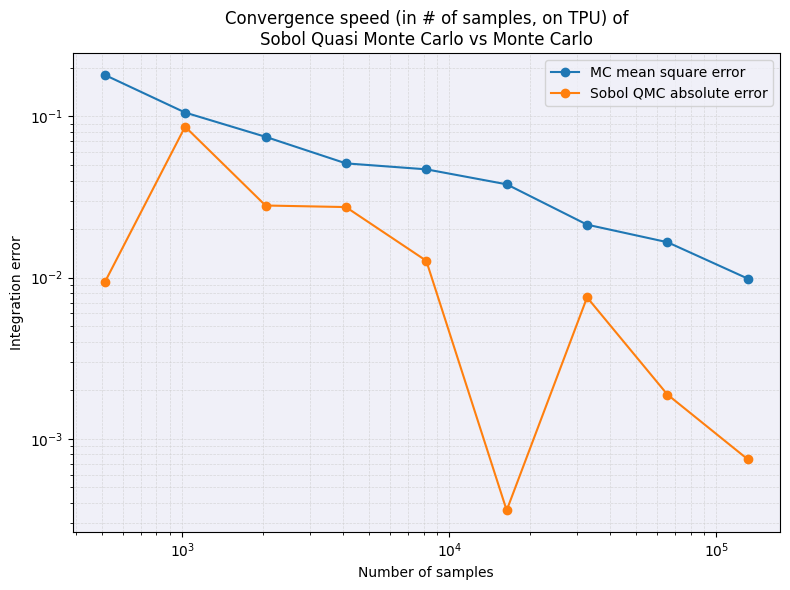
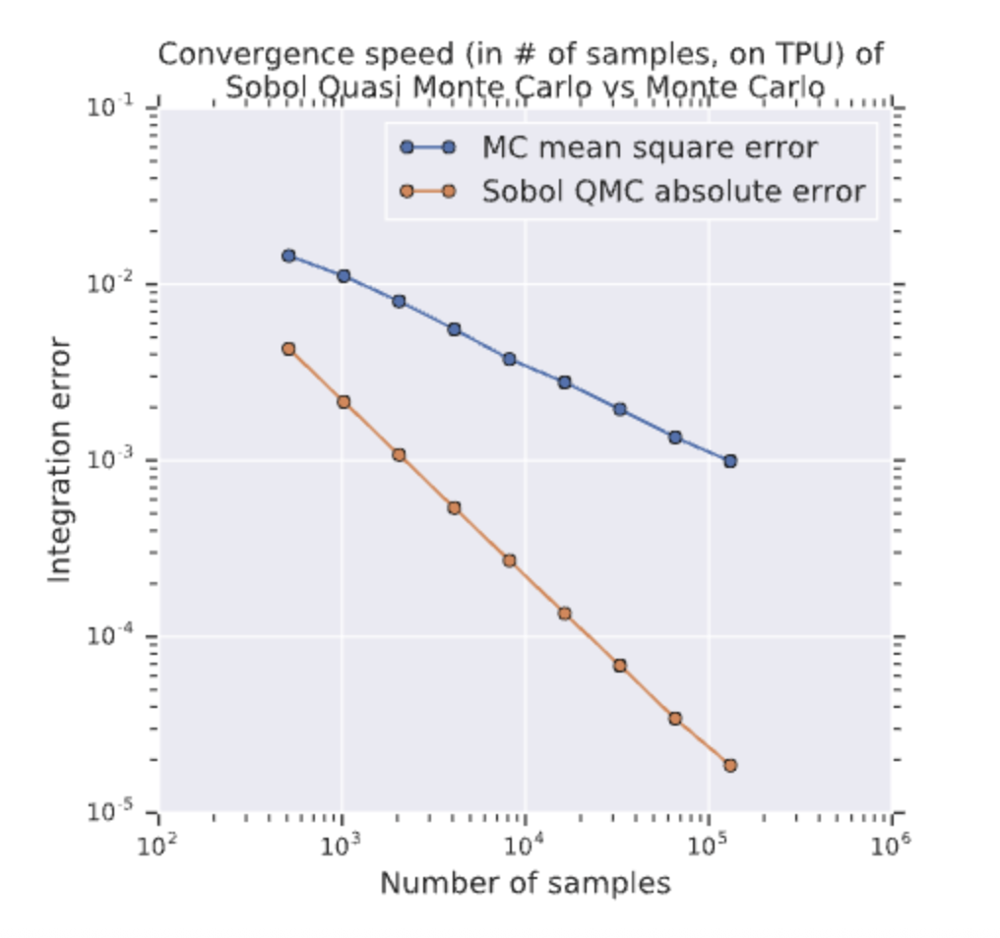

# Monte Carlo Simulation with Tensorflow (Black-Scholes & LMM)

This project demonstrates how to accelerate financial Monte Carlo simulations using Tensorflow. We implement both baseline and low-precision (bfloat16) version. We also leaverage Tensor Core acceleration for the execution speed optimization.

## Features
- Black-Scholes option pricing with Monte Carlo simulation
- Libor Market Model (LMM) path simulation with Cholesky factorization
- Support for float32 and bfloat16 precision
- Performance benchmarking and precision comparison
- Visualization of error curves and execution times

## Usage
1. [](https://colab.research.google.com/github/RR-project-group/TC-AcceleratedMonteCarloSimulation/blob/main/main.ipynb)

2. To connect to a TPU runtime in Google Colab, follow these steps:
- Go to the menu bar, click on Runtime → Change runtime type.
- In the popup window, under Hardware accelerator, select TPU.
- Click Save.
- After that, your notebook is connected to a TPU runtime. You can verify by running:

3. Outputs:
- Visualizes relative error between bfloat16 and float32
- Runtime comparison of both precisions

## Notes
- Ensure a Colab TPU backend is available for best results

----

# Convergence of Sobol QMC vs Monte Carlo on TPU

---

## Objective

The goal of this experiment is to reproduce Figure 7 from the original paper, comparing the convergence speed of Monte Carlo (MC) and Sobol Quasi Monte Carlo (QMC) methods for a high-dimensional integration problem, executed on a TPU backend.

---

## Methodology

### 1. Target Function

- **Function**: Basket Option payoff  
  \( \max\left(\frac{1}{d} \sum_{i=1}^{d} \exp(x_i) - K, 0\right) \)
- **Dimension**: \( d = 16 \)
- **Distribution**: \( \mathcal{N}(0, 1) \) standard normal  
- **Sobol Normalization**: Applied Box-Muller transform to Sobol samples to approximate Gaussian input

---

### 2. True Price Estimation

To evaluate the integration error, a reference “true price” is needed.

- Computed using **Monte Carlo with 100 million samples**
- Executed on TPU to ensure numerical stability and performance
- Resulting value:  
  \[
  \texttt{true\_price} \approx 6.956624
  \]

---

### 3. Monte Carlo Simulation (MC)

- For each sample size \( N \), ran **50–100 repetitions**
- Each trial computes an estimate using standard Gaussian samples
- Final error is the **root mean square error (RMSE)**:
  \[
  \texttt{RMSE} = \sqrt{\mathbb{E}[(\hat{I}_\text{MC} - I)^2]}
  \]

---

### 4. Sobol Quasi Monte Carlo (QMC)

- Used Sobol sequences with dimension \( d = 16 \)
- Applied Box-Muller transform to approximate normal distribution
- Introduced **random shifts** to reduce structural artifacts
- For each sample size \( N \), computed average of multiple shifts
- Reported **absolute error**:
  \[
  \texttt{Abs Error} = |\hat{I}_\text{QMC} - I|
  \]

---

### 5. Visualization

- **X-axis**: Number of samples (log scale)
- **Y-axis**: Integration error (log scale)
- **Curves**:
  - Blue: Monte Carlo RMSE
  - Orange: Sobol QMC Absolute Error

---

<div style="display: flex; justify-content: space-between; gap: 10px;">
  <div style="flex: 1; text-align: center;">
    <br>
    <b>Reproduced Plot</b>
  </div>
  <div style="flex: 1; text-align: center;">
    <br>
    <b>Original Figure (from paper)</b>
  </div>
</div>

## Results & Analysis

### Correctly Reproduced:

| Aspect                          | Match with Original Figure      |
|----------------------------------|----------------------------------|
| **Error magnitude**              | From \(10^{-1}\) to \(10^{-4}\) |
| **MC convergence**              | \( \mathcal{O}(1/\sqrt{N}) \)   |
| **QMC faster convergence**      | Linear-like decay, superior to MC |
| **Crossover point**             | QMC outperforms MC from ~1k samples |

---

### Differences Observed:

| Issue                             | Analysis |
|----------------------------------|----------|
| **QMC curve is jittery**         | Original paper likely used more advanced scrambling and dimensional reordering |
| **Final error slightly higher**  | Approximation error from Box-Muller + Sobol; possibly fewer randomizations |

---

## Conclusion

This reproduction successfully validates the claim that **Sobol Quasi Monte Carlo outperforms standard Monte Carlo** in high-dimensional integration, even on TPU hardware.

- QMC achieves significantly faster convergence from medium sample sizes (~1,000+)
- MC remains consistent with expected \( \mathcal{O}(1/\sqrt{N}) \) error reduction
- Results confirm the paper’s message despite slight numeric noise

---

## Suggested Improvements

1. **Use Owen scrambling** to improve QMC smoothness
2. **Apply real-world covariance matrices** for basket pricing realism
3. **Increase true value estimation accuracy** using double precision
4. **Test across more dimensions and payoff structures**
## Reference

This project is a reproduction of this work:

**Rasch, A., & Gauckler, L. (2020). Tensor Processing Units for Financial Monte Carlo.**  
*In International Conference on High Performance Computing (pp. 1–12).*  
[SIAM DOI: 10.1137/1.9781611976137.2](https://epubs.siam.org/doi/abs/10.1137/1.9781611976137.2)
<details>
<summary>BibTeX</summary>
```bibtex
@inproceedings{rasch2020tpu,
  author = {Rasch, Andreas and Gauckler, Ludwig},
  title = {Tensor Processing Units for Financial Monte Carlo},
  booktitle = {Proceedings of the Platform for Advanced Scientific Computing Conference},
  year = {2020},
  publisher = {SIAM},
  doi = {10.1137/1.9781611976137.2},
  url = {https://epubs.siam.org/doi/abs/10.1137/1.9781611976137.2}
}